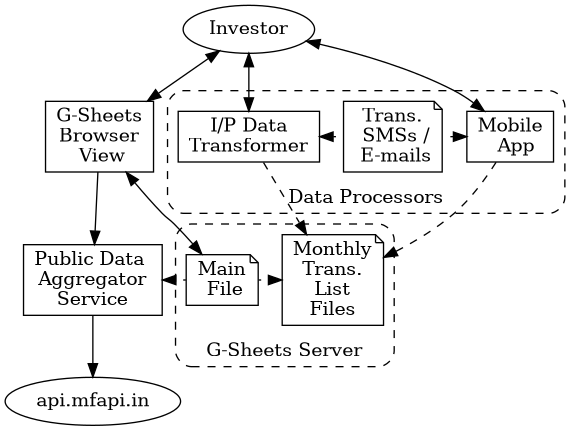

## Personal Investment Status Tracker

Most of us have investment in mutual-funds, stocks,etc. We might have them with multiple stock brokers or in multiple bank accounts.
In this case, we lack a unified view of the current status of these investments.

This repo contains scripts and web services to created such an unified view of ones personal investments. Google-sheets is used for implementing the dashboard and does not require any other tool. But it requires install a mobile app or running a job to process your statements sent via e-mail.

### Components Architecture

The diagram below shows the different components of the overall system. Somes points to be noted are:

1. Google sheets main workbook shows the current status of the investment with delayed data provided by [GOOGLEFINANCE() function](https://support.google.com/docs/answer/3093281?hl=en).
1. The dashboard for the investor is the main sheet of the G-Sheets Excel workbook.
1. The processor for transforming the input data in bank statements & stock traded statements (sent as attachments) by e-mail or SMS can be either:
    * Custom mobile app to process the SMS or statements in e-mails.
    * Custom script which can be run by the investor in his/her own non-mobile device.

**Note:** The source graphviz dot file for the above image is in: `docs/comps_arch.dot` file.

The APIs to be implemented by the *Data Aggregator Service* are:

1. To get the latest value of a mutual-fund (in India) given the ID maintained by `api.mfapi.in` service.
    * The end-point to get all the historical fund value is `https://api.mfapi.in/mf/<id>`.
    * The mutual-fund name to the id mapping is from maintained in global Excel file.
1. To get sparkline image of a mutual-fund (in India) given its id.

### Features & their Implementation Status

The following are to be implemented:

1. Color coding of the investment line-item value compared to the previous day's value.
1. Using the G-Sheets [SPARKLINE function](https://support.google.com/docs/answer/3093289?hl=en&ref_topic=3105411) to show the trend of the stock in the last few days.
1. [G-Sheets Custom Function](https://developers.google.com/apps-script/guides/sheets/functions) implementation for [invoking using urlfetch](https://developers.google.com/apps-script/reference/url-fetch) the following:
    * Function for showing the sparkline of the MF recent history. This will invoke the sparkline data aggregator service.
    * Function to get the current value of a set of MF given their IDs. This will invoke the data aggregator service end-point.
1. Need to check if [IMPORTRANGE()](https://support.google.com/docs/answer/3093340) function works in the following specific cases:
    * To get the values in columns of CSV files. If it does not work, we need to write a service to convert from CSV file to `xlsx` file format.
1. Provide a simple Heroku install button from the forked repo for easier configuration & installation of teh service & data-processing script.
